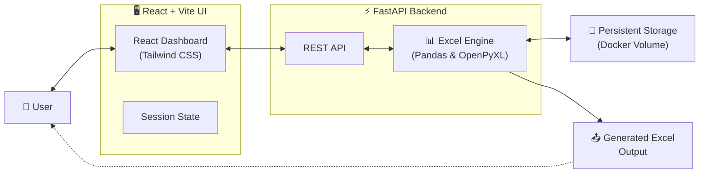
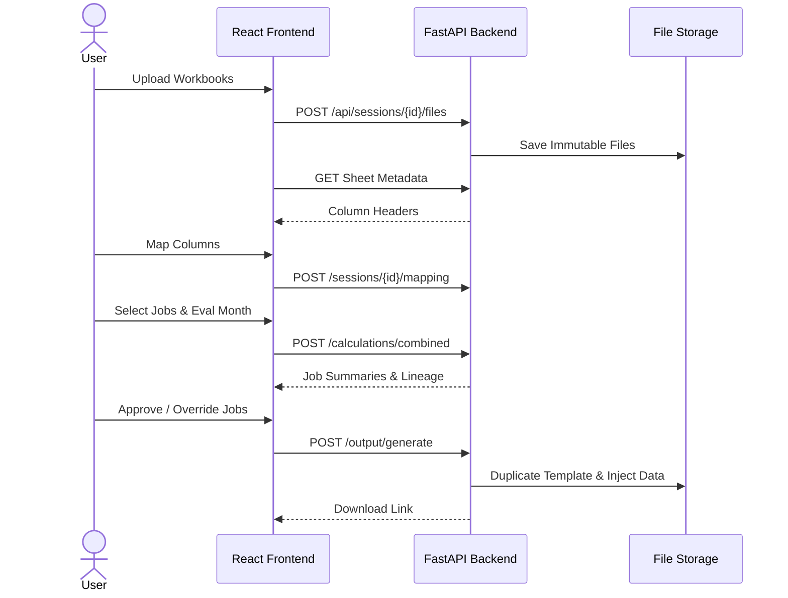

<div align="center">

# 🚀 EIL Audit Automation

**Intelligent Excel Inspection & Audit Processing**

*Automate → Analyze → Review → Approve → Generate*

[](#)
[](#)
[](#)
[](#)
[](#)

[](#)
[](#)
[](#)
[](#)

</div>

---

> 🚀 **AUTOMATE THE BORING WORK**
>
> Stop copy-pasting between spreadsheets. Upload your source Excel workbooks and let the application automatically map, analyze, and generate a pristine, formula-ready audit report.

> 📊 **EXCEL INTELLIGENCE**
>
> Native `xlsx` parsing using Pandas and OpenPyXL. The system dynamically reads custom column headers, applies business rules, and injects data without destroying your original template styles.

> 🛡️ **SAFE & AUDITABLE**
>
> Every calculation provides a complete lineage trace. You have full manual override capabilities and an explicit approval workflow before any output is generated.

---

## 🏛️ System Architecture

The application is built on a decoupled, containerized architecture ensuring maximum performance and portability.



---

## 🔄 The 6-Step Workflow Engine

The EIL Audit engine enforces a strict, guided workflow to ensure data integrity at every stage.

| Step | Action | Description |
| :---: | :--- | :--- |
| **1** | 📤 **Upload** | Upload Excel 1 (Consolidated), Excel 2 (Inspection Log), and Excel 3 (Master Template) into an isolated session. |
| **2** | 🗺️ **Map** | Visually map logical business fields to the actual spreadsheet columns found in your uploaded files. |
| **3** | 🔍 **Jobs** | The engine automatically extracts the Master Job List from Excel 3. Select which jobs to process. |
| **4** | 🧮 **Analyze** | Select an **Evaluation Month**. The engine crunches historical data and applies complex date-window logic. |
| **5** | ✅ **Review** | Interactive dashboard with **non-zero highlighting**. Apply manual overrides, view calculation lineage, and Approve rows. |
| **6** | 📥 **Output** | Generate a perfectly styled output workbook. Unused rows are stripped, styles are preserved, and `=SUM()` formulas are injected. |

<details>
<summary><b>🎬 View Workflow Sequence Diagram</b></summary>


</details>

---

## 🧠 Technical Deep Dive: Excel Processing

The system doesn't just copy data; it understands it. Here is how the business logic interprets your workbooks:

<details open>
<summary><b>📊 Excel 1: Consolidated Report Logic</b></summary>

Excel 1 provides historical running order data. It is evaluated on a **strict 6-month historical window** (5 months prior to the Evaluation Month + the Evaluation Month itself).

*   **FD**: Counted if `Balance Quantity == 0` AND `OCS Date` is strictly blank.
*   **OCS Done**: Counted if `Balance Quantity == 0` AND `OCS Date` is present and falls within the 6-month window.
*   **Running Orders**: Counted if `Balance Quantity != 0`.

*(Records with an OCS Date falling entirely outside the 6-month window are excluded.)*
</details>

<details open>
<summary><b>📋 Excel 2: Inspection Log Logic</b></summary>

Excel 2 provides inspection and received dates.

*   **Inspection (Days)**: `(Inspection Upto Date - Inspection From Date) + 1`. <br/>*Constraint*: Both dates must occur strictly within the chosen Evaluation Month.
*   **Others**: Looks at the `Date Received`. If the received date is within the 6-month window, it extracts the value from `QAP Appl.`. If `QAP Appl.` is blank, it falls back to the `Working Days` column.
</details>

<details open>
<summary><b>🧮 Final Total Calculation</b></summary>

The combined output engine calculates the final metrics to be injected into Excel 3:

1.  **Expediting** = `(Running Orders + OCS Done) * 2`
2.  **Total** = `Expediting + Inspection (from Excel 2) + Others (from Excel 2)`
</details>

---

## 🐳 Production Deployment (Docker)

The application is completely containerized. You do **not** need Python, Node, or any local dependencies to run the production version.

### 1. Setup & Start
Clone the repository, create the storage volume, and launch:

```bash
git clone https://github.com/Sandarsh18/eil.git
cd eil

# Create persistent storage directory
mkdir -p storage

# Pull the prebuilt v1.3.0 images & start
docker compose -f docker-compose.prod.yml pull
docker compose -f docker-compose.prod.yml up -d
```

### 2. Access the Application
*   **Frontend UI**: [http://localhost:5173](http://localhost:5173)
*   **Backend API Docs (Swagger)**: [http://localhost:8000/docs](http://localhost:8000/docs)

### 3. Useful Commands
```bash
# View running containers
docker compose -f docker-compose.prod.yml ps

# View backend/frontend logs
docker compose -f docker-compose.prod.yml logs -f

# Shut down the application securely
docker compose -f docker-compose.prod.yml down
```

---

## 🛠️ Developer Documentation

<details>
<summary><b>📁 Project Structure</b></summary>

```text
eil/
├── backend/
│   ├── app/
│   │   ├── api/          # FastAPI Route Endpoints
│   │   ├── schemas/      # Pydantic Data Models (I/O)
│   │   ├── services/     # Core Business Logic & Calculation Engines
│   │   └── utils/        # Date & Numeric Parsers
│   ├── tests/            # Pytest Unit & Integration Tests
│   └── Dockerfile
├── frontend/
│   ├── e2e/              # Playwright End-to-End Tests
│   ├── src/
│   │   ├── components/   # React UI Components
│   │   ├── pages/        # Dashboard Views
│   │   └── services/     # API Client configuration
│   └── Dockerfile
├── storage/              # Immutable file storage (Git Ignored)
├── docker-compose.yml    # Development (Source Build) Compose
└── docker-compose.prod.yml # Production (Docker Hub) Compose
```
</details>

<details>
<summary><b>🔌 API Endpoints Summary</b></summary>

The FastAPI backend provides a comprehensive REST API. Full documentation is available at `/docs` when running.

| Route | Method | Purpose |
| :--- | :--- | :--- |
| `/api/sessions` | `POST` | Create a new isolated processing session |
| `/api/sessions/{id}/files/{type}` | `POST` | Upload Excel 1, 2, or 3 |
| `/api/sessions/{id}/mapping` | `POST` | Submit column header mappings |
| `/api/sessions/{id}/calculations/combined`| `POST` | Execute the rules engine |
| `/api/sessions/{id}/jobs/{job}/approve` | `POST` | Approve a job for output |
| `/api/sessions/{id}/output/generate` | `POST` | Generate the final `.xlsx` file |
</details>

<details>
<summary><b>🧪 Testing Suite</b></summary>

The project maintains rigorous testing standards to ensure calculation accuracy.

**1. Backend Unit & Integration Tests (Pytest)**
Executes 60+ tests verifying date extraction, OCS window logic, and Excel native formula preservation.
```bash
cd backend
python -m venv venv
source venv/bin/activate
pip install -r requirements.txt
pytest tests/
```

**2. Frontend E2E Tests (Playwright)**
Simulates a real user clicking through the entire 6-step workflow in a headless Chromium browser.
```bash
./run_e2e.sh
```
</details>

---

## ⚠️ Limitations & Troubleshooting

*   **Excel Memory**: The application processes Excel files in memory using Pandas. Extremely large files (>50MB) may require tuning the Docker memory limits.
*   **Column Mapping**: If the engine fails to detect Job Numbers, ensure that you mapped the exact header string in Step 2. Hidden characters in Excel headers can cause mismatches.
*   **Port Conflicts**: If the backend fails to start, ensure port `8000` is free. If the frontend fails, ensure port `5173` is free. Use `docker ps` to check for ghost containers.

<div align="center">
<br/>
<sub>Built with ❤️ for automated data integrity.</sub>
</div>
